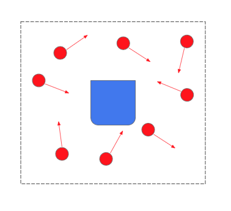

# Function Implementations

For each behavior, describe the problem at a high-level. Include any
relevant diagrams that help explain your approach. Discuss your strategy
at a high-level and include any tricky decisions that had to be made to
realize a successful implementation.

## Initialize Particle Cloud

In order to start with a particle filter to have the robot represent its
possible positions and orientations in space, we need to set up the
robot's particle cloud. The $initialize\_particle\_cloud()$ function is
designed to setup the robot's particle cloud.

The function first checks whether a specific position $xy\_theta$ has
been provided since the robot needs to estimate its starting position
based on its current belief. If not, it defaults to using the robot's
current position, which it retrieves through odometry.

In order to create the new particles, the function defines a range of
5x5 meter squares, as seen in
Figure [1](#fig:wall-follow-lidar){reference-type="ref"
reference="fig:wall-follow-lidar"} represented as unit around the
provided or estimated position, within which the new particles will be
generated. The unit itself was chosen through trial and error for the
best range. We also chose about 400 particles for the number of
particles to be created through trial and error. For each particle,
random values for the x and y coordinates are selected within this
range, simulating a possible robot position. The orientation (theta) is
assigned by randomly selecting an angle between 0 and 360 degrees and
converting it into radians. The created particles are then appended to
the particle cloud, which represents the possible locations the robot
might be in.

{#fig:wall-follow-lidar width="60%"}

Finally, the function calls $self.normalize\_particles()$ to ensure that
the weight distribution of the particles is normalized since it
represents the likelihood of each particle corresponding to the true
state of the robot, making the particle cloud ready for further
processing and resampling through localization.

## Normalize Particles

With our particles initialized, we now normalize their weights. We
summed up the weights of all the particles, them divided each particle's
weight by the total. $$w_{total} = \sum_{i=1}^{n}w_i$$ where $w_{total}$
represents the sum of all the particle weights, $n$ represents the total
number of particles, and $w_i$ represents the weight of the $i$th
particle. Next, we divided each of the weights by the total, such that:

$$\sum_{i=1}^{n}\frac{w_i}{w_{total}} = 1$$

and updated the weights of each particle to be normalized.

## Update Particles with Odometry

In our run loop, after checking for whether the robot has moved far
enough for an update, we call $update\_particles\_with\_odometry()$ to
update all our particles' positions in the map frame. To implement this
function, we start with the previous and current odom pose in
$(x, y, \theta)$.

With these poses, we're looking for the transformation between the two
in the map frame that we can then apply on the particles. We first take
the delta of the two odom poses
$$\Delta_t = (x_t - x_{t-1}, y_t - y_{t-1}, \theta_t - \theta_{t-1})$$

We're looking to apply the $(x_{\Delta_t},y_{\Delta_t})$ vector onto
each particle in its own frame. Therefore, for each particle, we first
rotate the $(x_{\Delta_t},y_{\Delta_t})$ vector by the heading of the
particle

$$\text{rotated transform} = 
    \begin{bmatrix}
        \cos{\theta_{(p, t)}} & -\sin{\theta_{(p, t)}}\\
        \sin{\theta_{(p, t)}} & \cos{\theta_{(p, t)}}
    \end{bmatrix}
    \begin{bmatrix}
        x_{\Delta_t}\\
        y_{\Delta_t}
    \end{bmatrix}$$

Next, we update the particles' $x$ and $y$ position
$$x_{(p, t)} = x_{(p, t)} + x_{\Delta_t} \\
    y_{(p, t)} = y_{(p, t)} + y_{\Delta_t}$$

Finally, we update the heading of the particles by the
$\theta_{\Delta_t}$
$$\theta_{(p, t)} = \theta_{(p, t)} + \theta_{\Delta_t}$$

## Update Particles with Laser

The $update\_particles\_with\_laser$ function updates the weights of
each particle in the particle filter based on sensor data from a laser
scanner. This function plays a crucial role in particle filtering by
adjusting the particles' likelihood based on how well they match the
observed environment.

For each particle in the $particle\_cloud$, the code iterates over all
the laser readings (theta and r). It computes the predicted (x, y)
position of an obstacle relative to the particle by applying
trigonometry (cosine and sine functions) to the particle's position and
orientation. This approach aligns the particle's pose with the laser
scan data to estimate what the particle would \"see\" in its
environment.

The laser projection formula we used for each laser scan angle
$\theta\_i$ (where $\theta\_i$ is the relative angle of the laser scan
in the robot's local frame), and the corresponding laser range $r_i$
(the distance to the nearest obstacle at angle $\theta\_i$, the global
coordinates $(x_o, y_o)$ of the detected obstacle relative to the
particle's position $(x_p, y_p)$ and orientation $\theta\_p$ can be
computed as shown in the following formulas for both $x$ and $y$.

$$x_{o} = x_{p} + r_{i} * cos(\theta_{p} + \theta_{i})$$

$$y_{o} = y_{p} + r_{i} * cos(\theta_{p} + \theta_{i})$$

After calculating the relative distances of the particles from the
nearest object, the function then queries an $occupancy\_field$ to
determine the distance between the computed (x, y) position and the
nearest known obstacle. If the particle predicts a position that is too
far from an obstacle, or if the sensor data contains invalid values
(e.g., NaN or infinity), the particle's contribution is penalized by
adding a large value ($total\_distance$ += 100). This helps discard
particles that are unlikely to represent the robot's true position. We
chose this way instead of discarding the invalid values first to ensure
that particles predicting invalid or highly improbable positions will be
heavily penalized, reducing their chances of being selected in the next
resampling step.

Once all readings are processed for a particle, the average distance
($distance\_mean$) between the particle's predicted obstacles and the
real ones is computed. The particle's weight ($p.w$) is then updated as
the inverse of this average distance (1/$distance\_mean$), meaning
particles that better align with the actual laser readings (i.e., with
smaller average distances) will receive higher weights. This approach
helps focus the particle cloud on the areas of the environment most
likely to represent the robot's actual location.

## Resample Particles

The $resample\_particles$ function implements the core resampling step
of the particle filter algorithm since it refines the particle cloud by
selecting the most likely particles based on their weights and
redistributing them to better reflect the robot's true position. The
function leverages a weighted sampling approach and introduces noise to
maintain some diversity among the particles.

The first step of the function ensures that the weights of all particles
are normalized. Normalization is necessary because the particle weights
represent probabilities that must sum to 1. This is a crucial design
decision, as without normalized weights, the resampling process would
not function properly. Particles with higher weights (higher likelihood
of representing the robot's true pose) will have a greater chance of
being selected.

Once the weights are normalized, the function uses the
$draw\_random\_sample$ helper function to resample particles according
to their weights. This step ensures that particles with higher weights
are selected more frequently, concentrating the particle cloud in areas
of higher probability. The function replaces the current
$particle\_cloud$ with a new set of resampled particles, preserving the
number of particles ($self.n\_particles$). This design choice is based
on the core idea of the particle filter---keeping the highest
probability estimates while discarding less likely hypotheses.

After resampling, the function introduces some random Gaussian noise to
the positions and orientations of the resampled particles. This is a
critical design decision because it helps maintain diversity in the
particle cloud, preventing it from collapsing too quickly around a
single point, especially in the presence of sensor noise or uncertainty
in the environment. The noise is scaled by each particle's weight
($particle.w$), meaning that particles with higher weights (which are
more confident predictions) will receive less noise, while particles
with lower weights will receive more noise.

The $position\_noise$ and $theta\_noise$ variables allow for control
over the amount of randomness introduced to the particle positions and
orientations during resampling. By adding this noise, the particle
filter avoids becoming too deterministic, allowing it to explore the
space and account for potential uncertainties in movement or sensor
readings. The choice of values for these parameters (here set to 1)
reflects a balance between maintaining enough particle variation without
making the cloud too noisy.

## Update Robot Pose

Finally, with our particles' positions updated, we took the mean of all
of them as the robot's pose. Therefore, as more particles converge on a
location, the closer the mean will be to the position of convergence.

To take the mean, we first summed up all of the particles' positions
$$(x_{total}, y_{total})\sum_{i=1}^{n}(x_i, y_i)$$ then divided the
totals by the number of particles:
$$x_{robot} = \frac{n}{x_{total}}, y_{robot} = \frac{n}{y_{total}}$$
Finally, we set our robot's position in $(x,y,z)$ in the map frame to be
$(x_{total}, y_{total}, 0)$.

# Challenges, Improvements, and Final Remarks

The largest challenges of the project involved understanding the problem
and going about implementing it. While the Conceptual Overview assigned
definitely helped, it was only when we started to implement the
functions was when we understood the crucial steps of a particle filter
and we wished we knew that just going in quickly to conceptually
thinking and implementing the functions would have been better for us.

Another challenge we had was debugging the project as it was difficult
for us to test without all the pieces to come together. We thought
debugging each function would work, but we ended up finding it easier to
implement the functions and go step by step of our implementation to see
what was wrong.

In terms of improvements, we noticed a lot of implementations we could
refactor. For example, our cost function in
$update\_particles\_with\_laser$ currently heavily penalizes blank
space, giving values of $NaN$ or $\inf$ high values that contribute to
the total distance that we then take the mean of later. With areas that
have a lot of blank space, we 'artificially' increase the mean so that
the particles will have a small weight. One option for debugging on the
MAC map would be opting for a different cost function that disregards
these values of $NaN$ or $\inf$ instead of including them in the total
distance with an arbitrarily large value.

Additionally, we noticed during testing in the MAC map that particles
would not always move the direction of their heading, but translate
side-to-side instead. We could definitely double-check our
implementation for our $update\_particles\_with\_odometry$ despite our
pseudocode and transformations making sense.

Lastly, we noticed that our $resample\_particles$ could also be
improved. We found that in testing the MAC file, we ran into particle
clouds converging together on the far edges of our particle-initializing
range. These particle clouds were clearly wrong, but we had trouble
breaking them up by resampling them. In our currnet implementation, we
resample every particle. One thing we tried implementing when testing on
the MAC was only resampling 80% of the particles with the highest
weights, and re-initializing the remaining 20% of the particles.

While it would have been nice to go beyond, we are satisfied that we
locked down a basic understanding of a particle filter.
